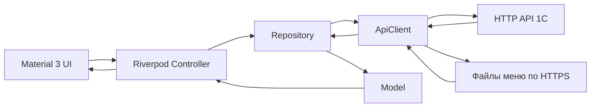

# Архитектура «Полевой кухни»

02.10.2026, FL-UX-27b: обычный набор многодневный. CartEditController хранит membership/revisions, исходные составы и выбранную дату, навигация не завершает активный набор. CartWorkStore v1 изолирован по API/окружению/login/устройству, сериализует записи/очистку; восстановление проверяет snapshot перед применением локальных количеств. CartChangedDatesProvider сравнивает количества, CartSubmissionPricingProvider считает только отправляемые дни. CartPage использует горизонтальные вкладки и общее подтверждение отмен. CartSubmitController отправляет один basket только изменений с исходными revisions/ownerScope/includeSnapshot, сохранённым pending и неизменным повтором. Незавершённая отправка имеет приоритет. Сценарий повтора остаётся отдельным. Это уточняет прежнее ограничение обычной подготовки одной датой; серверные контракты прежние. [Контракт](docs/cart-multiday.md), [карточка b](docs/tasks/FL-UX-27b.md), [отчёт](docs/testing/FL-UX-27b/README.md). Общий код Web/Android/iOS, локальный Web +64; публикация и платформенная приёмка отдельно.

01.10.2026, FL-DESIGN-02: пользователь выбрал «Белую кухню». Общая Material 3 тема Web/Android/iOS использует белые поверхности, зелёный #305F3D, светлые зелёные подложки, радиус 12 px и вторичный золотистый акцент. Web bootstrap/PWA согласованы с темой. Панели каталога 224/400 px от 1200 px, карточки 2/3 на 1200/1440; при крупном тексте сетка сокращает колонки. Фотографии блюда/категории и полного состава — contain на белом; главная получает фото/название/исходную цену реального блюда из меню через router, без импорта чужого feature в site UI. Бизнес-контроллеры, API, скидки, доступность, revisions/pending и сохранение заказов не меняются. План/фактическое состояние: [FL-DESIGN-02](docs/tasks/FL-DESIGN-02.md). Это уточняет прежнее визуальное оформление этапа 10; маршруты и платформенные правила сохраняются.

Версия 1.0 · 26.09.2026 · задача [FL-01-04](docs/tasks/FL-01-04.md).

## 1. Назначение и статус

Это целевая архитектура единого клиента Web/Android/iOS. Основания: [ТЗ](<Техническое задание.md>), решения пользователя и [справка NewProject](docs/newproject-reference.md). Указания пользователя и ТЗ имеют приоритет; согласованные исключения записываются здесь по П5. [AGENTS.md](AGENTS.md) содержит порядок работы, а [PROJECT_STATE.md](PROJECT_STATE.md) — фактическую точку продолжения.

После FL-01-13 реализованы запуск, конфигурация, первый экран site, тема/строки, единый router, адаптивный каркас, общий ApiClient и инфраструктура сессии через ручные Riverpod providers. SessionRepository использует общий транспорт, SessionController восстанавливает и очищает сессию, router получает её фактический статус. Модуль `features/menu` (Model → Repository → Controller → UI, ADR-6) читает публичный `dishes.json`, сопоставляет дни с `Orders/menudates`, показывает карточки/изображения и пишет количества в `features/cart`; подключён к `/menu` и широкой панели shell (FL-04). Модуль `features/cart` (этап 5) считает предпросмотр единым pricing-модулем, хранит черновик по владельцу, отправляет `Orders/basket` с `submissionId`, обрабатывает неопределённый исход через `basketresult`, показывает историю и повтор заказа на `/orders`/`/cart`. Формы входа и профиль реализованы в этапе 3; живая приёмка отдельных серверных сценариев и iOS ещё впереди. Названия остальных файлов ниже задают будущие границы; создавать пустые каталоги или объявлять функции готовыми на основании документа нельзя.

## 2. Единая схема и границы

Стек: Flutter/Dart, Material 3, Riverpod для состояния и внедрения зависимостей, go_router для адресуемой навигации. Сетевые данные поступают из существующего HTTP API 1С и опубликованных файлов меню/изображений. 1С определяет права, допустимость операций и окончательные суммы. Файлы меню — отдельный источник чтения с контрактом, а не замена проверки заказа сервером.

Состав модуля: **Model → Repository → Controller → UI**. Во время работы запрос идёт от UI к Controller и Repository, ответ возвращается как типизированная модель и состояние экрана:



| Часть | Ответственность | Граница |
|---|---|---|
| Model | Неизменяемые типизированные бизнес-данные и явный разбор полей ответа | Не знает виджеты, сеть и состояние загрузки. Идентификатор сущности берётся из контракта; для суммы/даты не придумывается серверный ID |
| Repository | Операции конкретного модуля, параметры запросов, разбор ответа в модели | Пользуется общим транспортом; не содержит навигацию и BuildContext |
| Controller | Команды пользователя, загрузка и состояние операции через ручной Notifier/AsyncNotifier | Не собирает HTTP-запросы и не обращается к хранилищу напрямую; не получает BuildContext |
| UI | Отображение loading/data/empty/error, ввод, локальная валидация и вызов Controller | Не вызывает HTTP и не рассчитывает окончательные суммы заказа |
| ApiClient | HTTPS, сериализация, таймауты, транспортные и нормализованные API-ошибки | Не знает виджеты, маршруты и расчёт корзины. Формат токена/ошибок берётся из контракта, не предполагается Bearer/JWT |

Используются конкретные Repository и ручные модели/providers. Дополнительный интерфейс, DTO, service или mapper допустим только с объяснением конкретной проблемы в карточке. Общая инфраструктура не импортирует `features/`; модуль не импортирует чужой экран или Controller. Сборка зависимостей и совместная компоновка модулей выполняются в `app/`. Общий компонент переносится в `shared/` при подтверждённом повторном использовании. FL-06-20h добавила используемые несколькими экранами `shared/display_formats.dart` (только представление денег/дат) и `shared/external_link.dart` (результат внешнего запуска без UI); сообщение отказа показывает вызывающий экран, расчётные модели/транспорт не меняются.

Вызовы защищённого API и чтение публичных файлов имеют раздельные настройки. Токен нельзя автоматически добавлять к произвольному URL изображения или меню. В FL-01-13 общий ApiClient остаётся независимым от сессии; SessionApi добавляет реквизиты к запросам защищённых Repository и проверяет поколение сессии до/после ответа. Личные Repository и их состояние должны зависеть от sessionApiProvider; публичные данные используют apiClientProvider. HTTP-перенаправления отключены, чтобы тело с токеном не уходило на адрес из Location. Смена сессии и router не создают обратную зависимость транспорта от UI.

## 3. Целевая структура

```text
lib/
  main.dart                         # запуск и сборка зависимостей
  app/
    app.dart                        # MaterialApp и состав приложения
    router.dart                     # единственный go_router
    theme.dart                      # общая Material 3 тема
  core/
    api/                            # транспорт и типизированные ошибки
    auth/                           # состояние сессии и работа с токеном
    config/                         # публичная конфигурация окружения
    platform/distribution.dart      # установка и стартовый маршрут (ADR-8)
  shared/
    widgets/                        # только общие используемые виджеты
  features/
    site/  auth/  menu/  cart/  orders/  profile/
test/                               # критические расчёты и нужные сценарии
web/                                # HTML-загрузка, SEO, manifest, статика
android/  ios/                      # платформенные оболочки единого lib
```

Распределение ответственности:

| Модуль | Что ему принадлежит | Зависимость/проверяемый результат |
|---|---|---|
| `site` | Главная, информация о компании, доставка, контакты, `/install` | Общие страницы и ссылки; правила установки получает из distribution |
| `auth` | Вход, регистрация, подтверждение email, отправка реквизитов входа на зарегистрированную почту | Согласованные операции API; передаёт результат входа в `core/auth`, не хранит пароль для будущих входов |
| `menu` | Каталог блюд, категории, доступные даты и выбор количества | `dishes.json` и `Orders/menudates` имеют разные роли; контракт — FL-00-10 и FL-04-04 |
| `cart` | Позиции по дням, черновик, предварительный расчёт, отправка | `pricing.dart` — чистый Dart по согласованной спецификации; факт принятия и итог — из 1С |
| `orders` | История и выбор позиций для повторного заказа | Повтор формирует новый черновик с проверкой текущего меню/дат; не отправляет старый заказ автоматически |
| `profile` | Профиль, условия клиента, «О приложении», вход в сценарий удаления | Профиль обновляется по токену; операции учётной записи доступны через согласованную зависимость, без импорта чужого Controller |
| `core/auth` | Восстановление/очистка сессии, токен и состояние входа | Не реализует формы регистрации и не дублирует серверные права |

Передача блюда из menu в cart и заказа из orders в cart идёт через типизированные данные/команды, соединённые в `app/`; не через доступ к чужому состоянию экрана. Конкретные модели и сигнатуры определяются вместе с контрактом функции. Эталон читающего потока — `features/menu` (FL-01-17, бизнес-версия FL-04, маршрут `/menu`); количества пишутся в `cart_draft` до полной модели корзины этапа 5. Расчёт pricing остаётся чистым Dart.

## 4. Сессия, хранение и ошибки

Пароль используется для текущей операции входа или начала регистрации, не попадает в постоянное хранилище, логи, конфигурацию или повторную загрузку профиля. После операции освобождаются ссылки и очищаются поля ввода; гарантированное обнуление памяти управляемой среды не заявляется. Для новых клиентов FL-02-12 согласовала серверный `context_v1`: после `registrationstart` повтор и подтверждение используют только временный `requestId` и код по [каноническому контракту](../Zak/docs/self-registration.md). Реализация Flutter остаётся FL-03-08–10.

Сохранённый токен не означает проверенную сессию. Состояния сессии различают восстановление, подтверждённый вход, отсутствие входа и ошибку проверки связи. Подтверждённая недействительность токена очищает сессию и ведёт ко входу; таймаут сам по себе не считается истечением токена. При выходе и смене пользователя сбрасываются загруженные персональные данные и состояние запросов. Поздний ответ старого пользователя не должен возвращать его данные в новую сессию. Отзыв токена сервером — отдельная желательная FL-02-20.

| Данные | Политика | Основание |
|---|---|---|
| Токен | `flutter_secure_storage`, доступ через `core/auth`; ограничения Web проверить при выборе версии | NFR-SEC-3, FL-01-07/13; защита Web не приравнивается к мобильной |
| Черновик | `shared_preferences`: необходимые позиции, количества, даты и привязка владельца; перед восстановлением сверить владельца и актуальные данные | FR-C4, ADR-3, FL-05-05/06 |
| Выбранный день и настройки UI | Минимальное локальное хранение через `shared_preferences` | ADR-3 |
| Профиль, условия, меню и история | В памяти текущей сессии; постоянная локальная бизнес-база не создаётся | ADR-3, NFR-SEC-2 |
| Фотографии и статика | Кэш по FR-M4 и NFR-PWA-2; постоянные версии фото в SharedPreferences по источнику/имени, URL меняется по `photo_version`; не использовать кэш как источник актуальных цен/заказов | FL-04-09, FL-06-11; контракт v0.4 и ограничения — [FL-06-20g](docs/tasks/FL-06-20g.md) |
| `deviceId` | Принято пользователем 27.09.2026: постоянный UUID без New3_; в FL-01-13 UUID v4 хранится вместе с токеном в secure storage под отдельным ключом и сохраняется при logout. Ключи изолированы по окружению/API. Миграция старого DEVICE_ID отдельно | FL-01-13, C-07/C-08, FL-02-17, FL-08-04 |

Ошибки разделяются на потерю связи/таймаут, отказ авторизации, бизнес-отказ и неожиданный формат/сбой. Соответствие HTTP-кода и тела этому виду закрепляется по API-9; пароль, токен, полные профили и тела чувствительных запросов не журналируются. UI показывает понятное сообщение, введённые данные сохраняются в допустимых границах, успех появляется только после подтверждения сервера.

В FL-01-13 пользователь подтвердил восстановление через User/login с token/deviceId. HTTP 401 очищает токен; неоднозначный HTTP 400, сеть и неверный ответ при проверке сессии переводят её в unavailable без удаления токена. SessionGatePage допускает явный повтор проверки. Серверная проверка привязки и полнота профиля остаются FL-02-11/17; согласование клиента не подтверждает их готовность.

Для чтения возможен явный повтор пользователем. Для записи ApiClient не выполняет автоматический повтор. Повторное нажатие блокируется, пока отправка идёт. В FL-02-16 подготовлен [контракт Zak](../Zak/docs/safe-order-retry.md): Flutter получает `revision` дней через `Orders/basketstate`, отправляет неизменный снимок с `submissionId` и после потери ответа читает `Orders/basketresult`; повтор записи допустим только с тем же ID и телом. XML/BSL этой версии ещё не загружены/приняты в ИБ, клиентский сценарий остаётся FL-05-12. Наличие кнопки «Повторить» по FR-C5 не разрешает новый независимый POST при неизвестном исходе.

FL-06-20c: CartRepository делегирует постоянную попытку CartSubmissionStore (версия/владелец/API, без реквизитов сессии). CartSubmitController восстанавливает её без сетевого запроса; пользователь проверяет basketresult и только при not_found повторяет прежний ID/снимок. UI результата не зависит от пустоты черновика. Во время неопределённости редактирование заблокировано; поздние ответы отделены по поколению/repository. Legacy без области API не мигрирует автоматически. Подробности и проверки — [карточка](docs/tasks/FL-06-20c.md); общий код проверен локально, готовые Web/Android +4 его ещё не содержат.

FL-UX-18c (01.10.2026): обычная подготовка дня использует один `Orders/snapshot` по [отдельному контракту v1.0](../Zak/docs/order-snapshot.md). Полный профиль/история, доступность и states проверяются до синхронного применения; пользователь/поколение/scope и epoch не позволяют позднему ответу повредить данные. Применение профиля и дат не запускает login/menudates и не переводит даты в загрузку. Календарь покидается до запроса через экран подготовки FL-UX-17. Предварительная проверка отправки через basketstate и сравнение revision внутри basket сохраняются. Меню/изображения используют прежние публичные файлы; при отсутствующем snapshot — ошибка с повтором без автоматического fallback. Платформенная согласованность серверного снимка не подтверждена клиентскими тестами.

## 5. Маршруты, интерфейс и платформы

29.09.2026 принят целевой редизайн этапа 10: [«Городской обед»](docs/design/city-lunch.md). Корзина рядом с каталогом и полная верхняя строка от 1200 px, общий стиль трёх платформ; расчёты/API/маршруты без изменений. В FL-10-01 подготовлены документы и ассеты; FL-10-02 внедрила тему, шапку и новые пороги локально. Полная шапка сворачивается при нехватке места с учётом масштаба текста и в низком альбомном окне. FL-10-03 внедрила главную с адаптивным hero, естественной высотой категорий/преимуществ и общим графитовым подвалом. Источник категорий/фото и версии сохранён в router, hero — два общих WebP-ассета. FL-10-04 внедрила карточки каталога и панели: цена под названием/весом, управление 44 px, минимальная ширина 156/248 px, растущие названия и закрытие слоёв через Back/resize. API, фото/photo_version и ограничения заказа сохранены. FL-10-05 внедрила необязательный bottomSummary оболочки и CartSummaryBar в модуле cart; router связывает переход. На мобильном меню показаны все порции/дни и существующий расчёт, недоступность суммы и актуальность; расчёты не перенесены в оболочку. Корзина/история оформлены общей темой, предпросмотр и серверные суммы сохраняют прежнюю семантику. FL-10-06 добавила общую поверхность ContentPanel в shared для форм/справки/служебных экранов, переносимые заголовки информационных страниц и вертикальные поля профиля при нехватке места. Контроллеры и проверки W07 сохранены. Платформенного исключения не вводится, ADR-8/ADR-10 сохраняются.

Один router в `app/router.dart` содержит адреса из раздела 4.1 ТЗ: `/`, `/about`, `/delivery`, `/how-to-order`, `/contacts`, `/install`, `/sign-in`, `/sign-up`, `/reset-password`, `/menu`, `/cart`, `/orders`, `/profile`. В FL-01-10 закреплён публичный просмотр `/menu` по существующему сценарию сайта и FL-00-10; доступные дни и операции заказа требуют отдельной серверной проверки. `/cart`, `/orders`, `/profile` требуют подтверждённой сессии. Гость направляется ко входу с сохранением локального адреса; восстановление и ошибка проверки закрывают личное содержимое, сохраняя URI. Client redirect не заменяет серверные права. Реальная сессия подключается в FL-01-13; сейчас все пользователи — гости, незаполненные страницы обозначены как недоступные.

FL-10-11 (30.09.2026): все основные маршруты, включая главную, информационные страницы и вход, находятся в общей ShellRoute с одним Navigator. На публичных страницах оболочка заказа не показывается; оформление site сохраняется. Это устраняет повторный ключ страницы при цепочке заказы → главная → заказы через push. Позиция Router в панели Back имеет стабильный ключ; на главной кнопка «Назад» скрыта независимо от истории. В нижней панели всегда «Заказать» → `/orders`, с подсветкой на заказах; заполненность корзины подпись/назначение не меняет. Корзина доступна через итог меню, rail и широкую правую панель. После подтверждения сессии активный вход, открытый через push, заменяется целевым маршрутом без пересоздания router; выход с активного личного экрана сбрасывает защищённую историю. Блокировка W07 применяется и к этим переходам.

При обычном старте Web открывает `/` с ширины 1200 px, в узком окне — `/orders`, нативные Android/iOS-приложения — `/orders` (ADR-8, FL-10-10). Это значение по умолчанию: явный Web-адрес сохраняется и проходит общие проверки доступа; неизвестный адрес получает определённый экран/переход. Циклы redirect и перезапись запрошенного маршрута проверяются в FL-01-10.

В FL-AUTH-05 по поручению пользователя от 01.10.2026 `/reset-password` содержит форму почты и явную отправку через `User/passwordrecovery`. Сервер находит организацию по контракту [v1.0](../Zak/docs/password-recovery.md), ставит письмо с действующими реквизитами в очередь. Пароль не заменяется; секреты не возвращаются клиенту. Неизвестные параметры адреса не используются. Это заменяет информационную страницу FL-03-11.

Material 3 и русские тексты общие; централизованное хранение строк и тема заложены в FL-01-09. В FL-10-02 приняты белый/графит/оранжевый, контрастные ссылки, текст 16/14 px, радиус 8 px и общие кнопки от 44 px; `Arial` с системным sans-serif используется как стек без встроенного файла шрифта, фактический вид на трёх платформах ещё не проверен. `LayoutBuilder` выбирает раскладку: `<600` — нижняя навигация, `600–1199` — левое меню, с `1200` — меню блюд и правая панель корзины, заказов и профиля без левого меню (FL-10-02). Категории занимают 249,6 px (на 20% шире прежних 208), правая панель — 320 px. Названия категорий в колонке переносятся по словам. Активный экран и прокручиваемая область меню переносятся с сохранением State; resize не пересоздаёт контроллер прокрутки. Гость видит закрытую корзину без личных данных. Тестами проверены Enter на rail, Back и resize; полная приёмка прокрутки, клавиатуры, данных и платформ — впереди. Отдельные Cupertino/Fluent-экраны не создаются.

Web, Android и iOS остаются обязательными платформами. Настольные устройства используют браузер. Для iOS выбраны облачная сборка Codemagic и браузерный симулятор App Preview; фактическая настройка и iOS-проверки остаются в FL-01-16 и приёмке выпуска. Минимальные версии и состояние инструментов — [FL-01-02](docs/tasks/FL-01-02.md).

## 6. ADR и исключения

ADR-1–ADR-7 сохраняют ID раздела 8 ТЗ. Они фиксируют требования проекта; новые технические детали не подменяют контракт сервера. Изменение действующего решения записывается с причиной, последствиями, поведением трёх платформ и задачами проверки.

| ID | Решение и основание | Последствия и проверка |
|---|---|---|
| ADR-1 | Существующий HTTP API 1С, транспорт через `http` и ApiClient; данные меню читаются из опубликованных файлов. Основание: ТЗ 4.1/8 | Repository знает операции; права и окончательные суммы определяет 1С. Контракты — API-указатель; FL-01-12, FL-02-11/15/17 |
| ADR-2 | Регистрация и доступ определяются моделью 1С. Основание: ТЗ ADR-2, FR-A1–A6 | Не придумывать клиентские роли/статусы. Пользователь 27.09.2026 выбрал отключение только текущего устройства; это не удаление аккаунта FR-A6. История заказов, организация и профиль сотрудника остаются; полный сценарий удаления открыт до отдельного решения |
| ADR-3 | Разрешены черновик корзины, выбранный день и настройки; токен — отдельное требование NFR-SEC-3. Основание: FR-C4 и раздел 8 | Черновик не даёт офлайн-права оформить заказ. Проверка владельца, устаревшего меню и очистки — FL-05-05/06; миграция старого `DEVICE_ID` — FL-08-04 |
| ADR-4 | Один `lib/`, три обязательные платформы Web/Android/iOS. Основание: Ц3, П1, ТЗ 4.3 | Платформенные каталоги содержат оболочки; общие функции проверяются на трёх платформах. Отсрочка iOS не меняет требования приёмки |
| ADR-5 | Кандидаты зависимостей — приложение А ТЗ; версии проверяются в FL-01-07 и фиксируются в `pubspec.lock` | Наличие в списке не доказывает совместимость выбранной версии. Подключать по назначению, учитывать Web-ограничения; ручные модели и providers без генераторов |
| ADR-6 | Первый эталон чтения — menu, затем cart. Основание: раздел 8 | Один подход Model → Repository → Controller → UI; расчёт cart изолирован в чистом Dart. `features/menu` подключён к `/menu` (FL-04-14); черновик количеств — `cart_draft`. Полная корзина — этап 5. |
| ADR-7 | Информационные страницы принадлежат модулю site; платформенные проверки собраны в `core/platform/distribution.dart`. Основание: П3, NFR-PWA-3 | Исходное разрешение — только установка/распространение. Стартовый маршрут — ADR-8. Портрет установленного Android/iOS — ADR-10 |

### ADR-8 — Разный старт для Web и нативного приложения

**Статус:** принято пользователем 26.09.2026 в FL-01-04; закрывает C-02 из [реестра решений](docs/tasks/FL-00-15.md).

**Причина:** раздел 4.1 ТЗ требует главную сайта в браузере и меню в установленном приложении; исходный П3 ограничивал проверку платформы только установкой. Пользователь разрешил также выбор стартового маршрута в distribution.dart.

**Решение (обновлено пользователем 01.10.2026, FL-UX-12):** обычный старт Web, Android и iOS — главная `/`, включая адаптивную раскладку. Автоматический переход узкого первого открытия в `/orders` убран. Явный URL, в том числе защищённый, сохраняет свой смысл: запрос входа возникает при открытии заказов или профиля, а не при обычном старте. Изменение ширины не меняет маршрут. Кнопка «Заказать обед» открывает `/orders` во всех раскладках. Router получает результат через зависимость. Платформенные проверки в router, бизнес-модулях и экранах не добавляются. Различие не меняет API, правила доступа, данные и расчёты. `/orders/categories` — защищённый экран категорий выбранного дня; FL-10-12 заменяет переход повторным кликом дня на вложенную кнопку «Заказать». Она подготавливает один день; ниже 1200 px непустой состав открывает `/orders` → `/cart` → `/orders/categories` → `/menu`, пустой состав пропускает `/cart` при входе. От 1200 px открывается `/cart` с каталогом. Обычный и повторный клик дня только выбирают его. FL-10-13 заменяет общую историю явным сценарием: главная — декларативный родитель основных разделов в единой ShellRoute, выбор раздела заменяет текущий; AppNavigation в app/navigation.dart строит ограниченную цепочку заказа, сокращает её при повторном шаге и сохраняет ключи форм. Изначально пустой день пропускает корзину; явное открытие корзины включает её в цепочку. Категории без сценария возвращаются в заказы; регистрация/восстановление — ко входу, документы из регистрации — в сохранённую форму. SiteBackAction передаёт действие в обе общие шапки; отдельной полосы Back нет. Кнопка и системный Back используют routerDelegate.popRoute, а AppRouteBackScope располагается внутри каждой страницы Navigator и обеспечивает смысловой родитель прямого URL/закрытие меню разделов. Фото/панели MenuPage имеют приоритет. SemanticUrlStrategy оборачивает прежний PathUrlStrategy в distribution.dart: новые браузерные возвраты/сокращения цепочки используют прежнюю запись, основные разделы заменяются; история до запуска не читается и не переписывается. Браузерный Back при открытом слое или W07 возвращает позицию истории и потребляет действие. URL/API/платформенный старт сохраняются; живая проверка браузерных событий отдельно от VM-модели истории. Установленная Web/PWA-версия остаётся Web для этого правила.

**Проверка:** в FL-01-10 проверить обычный старт каждой платформы, явный Web-адрес, общую обработку сессии и отсутствие циклов redirect; статически проверить расположение платформенных условий. Runtime-проверка iOS остаётся отложенной вместе со средой сборки.

### ADR-9 — Действие обновления приложения (проект)

**Web-часть принята прямым поручением пользователя 01.10.2026, FL-UX-21.** Новый валидный Web release применяется автоматической перезагрузкой без дополнительного сохранения данных и без ожидания submission. Проверка на старте, каждые 10 секунд активной вкладки и при foreground. Существующие token/draft/pending хранилища не очищаются; бизнес-запросы/автоповторы не добавляются. На release одна попытка; метаданные попытки в sessionStorage/URL предотвращают цикл после загрузки старого кода. Route/query/fragment сохранены, history replace. Index обновляется URL выпуска; inline bootstrap загружает main.dart.js со stamp сборки. Worker заново не регистрируется. Канал определяется distribution.dart, conditional browser-адаптер только core/platform. Native-действие остаётся проектом. Реальная браузерная миграция принимается отдельно; старые +57 вкладки сначала обновляются вручную. [Карточка](docs/tasks/FL-UX-21.md).

**Историческая исходная редакция до поручения FL-UX-21:** FR-P3 требует один результат проверки минимума на Android/iOS/Web, но Web перезагружается, а установленное приложение получает опубликованный выпуск через канал распространения. Проект разделения общего состояния и платформенного действия, условия сохранности и ограничения миграции worker — в [едином контракте W07 v0.1](docs/app-version-contract.md#5-обновление-и-сохранность). Определение платформы остаётся только в distribution.dart; адаптеры в core/platform, без платформенных проверок в features. Реализация действия обновления и принятие ADR — отдельный последующий шаг; текущий код/поведение не изменены.

### ADR-10 — Портрет установленного Android и iOS

**Статус:** принято пользователем 28.09.2026 в FL-09-16.

**Причина:** основной сценарий установленного приложения остаётся портретным. Блокировка ориентации в браузере ненадёжна. Поворот всей страницы через CSS не переносится.

**Решение:** Android и iOS держат портрет: манифест и `Info.plist` плюс тот же список в `distribution.dart`. Web, включая установленную PWA, ориентацию не блокирует: ключ `orientation` убран из manifest, `SystemChrome` не вызывается, страница целиком не поворачивается. Проверка платформы остаётся в `distribution.dart`.

**Проверка:** чистое правило покрыто тестом. Живой поворот Android и iOS не выполнялся; iOS не запускалась. Web-сборка с этим manifest ещё не выкладывалась.

## 7. Окружения, поставка и ограничения

API URL, источник меню/изображений, APP_VERSION_URL и название окружения задаются публичной конфигурацией сборки (FL-01-06, FL-06-20o). Конфигурация клиента не является хранилищем секретов. Test/prod должны быть различимы, но отдельной тестовой базы по решению пользователя нет: интеграционные проверки используют существующий API и выделенных тестовых пользователей рабочей базы; поддомен не изолирует базу. Пригодность аккаунтов/заказов проверяется до живых сценариев. Browser CORS остаётся открытым.

HTML первой загрузки, SEO, manifest и кэш статики находятся в `web/` того же репозитория; отдельный сайт не создаётся. Контракты минимальной версии, обновления Web/PWA и миграции старых ключей закрепляются до выпуска. Прежний пароль не импортируется. В FL-07-03 согласованы постоянные Android Application ID и iOS bundle ID `ru.obedmoscow.polevayakuhnya`; в исходниках пока стоят временные `com.example.*`, их замена выполняется до выпускной сборки.

В проект не входят Supabase/PostgreSQL/RLS и модель pending/admin из примера, отдельный серверный framework, локальная бизнес-БД, синхронизация/очередь офлайн-записей, самостоятельные desktop-приложения, push, биометрия, геолокация, камера, платёжные SDK, native deep links и параллельные платформенные экраны. В `features/` запрещены `dart:html`, `dart:io` и платформенные каналы. Не вводятся универсальный CRUD framework и генераторы моделей/providers. Создание платформенного каркаса штатным Flutter CLI не относится к запрету генераторов прикладного кода.

## 8. Открытые решения до реализации

Канонические схемы, методы и ошибки не копируются сюда: [API-указатель 0.1](docs/api-1c.md) ведёт к аудиту и серверным документам. Решения C-01–C-08 хранятся в [FL-00-15](docs/tasks/FL-00-15.md); C-02 закрыт ADR-8, C-03 остаётся в границе установки.

| Условие | Что нельзя считать решённым | Задача до зависимой реализации |
|---|---|---|
| C-01 | Решение `context_v1` зафиксировано и реализовано в исходниках Zak; работа на платформе и реализация Flutter не подтверждены | FL-02-12, затем FL-03-08/09/10 и интеграционная приёмка |
| API-4/C-08 | Полнота профиля/истории по токену, проверка устройства, формат ошибок | FL-02-11/17, FL-01-12/13 |
| C-04 | Достаточность окончательных сумм в существующем ответе | FL-02-15 перед FL-05-11 |
| Безопасный повтор | Идемпотентность и способ выяснить итог потерянного ответа | FL-02-16 перед FL-05-12 |
| C-05 | Пригодность тестовых аккаунтов и данных; browser CORS | FL-02-18, FL-00-14d/FL-02-17 |
| C-06 | Постоянные ID, совместимость подписей и владельцы ключей | FL-07-03/04/05 |
| C-07/C-08 | Хранение/миграция deviceId, перенос и владелец черновика | FL-02-17, FL-08-04 до соответствующей реализации/перехода |
| API-2/API-5 | Сброс пароля исключён; отключение устройства выбрано, но требует серверной привязки токена к устройству. Удаление аккаунта FR-A6 остаётся открытым | FL-02-13/14, затем FL-02-17/19 и отдельное решение до FL-03-15/07-13 |

## 9. Критерии дальнейших задач

В карточке функции до кода фиксируются бизнес-цель, данные, операции, контракт и его версия, UI-сценарий, валидация и проверяемый результат. При реализации проверяется прохождение через единый поток, отсутствие скрытого хранения и платформенных бизнес-веток. Для расчётов обязательны спецификация и тесты BL-1–BL-4; тесты и анализ входят в CI по INF-3. Проверки выполняются в разрешённых условиях, непроверенное явно сохраняется в карточке.

Последовательность основного сценария: вход → подтверждённая сессия → меню и доступные даты → черновик и предварительные суммы → подтверждение заказа и итог сервера → история. Отказ сети сохраняет допустимый ввод/черновик, а неизвестный итог отправки не превращается в ложный успех. Выход очищает сессию; повторный заказ проходит проверку актуальных данных. Этот сценарий подлежит приёмке на всех трёх платформах; документ и статический анализ не заменяют её.

FL-06-20l (W08): регистрация требует отдельного согласия до registrationstatus/start. Политика и отдельный текст доступны до запроса; router сохраняет форму при чтении. Выбор хранится в состоянии формы, сбрасывается при новой попытке и не меняет API context_v1. Серверный журнал факта/версии согласия — отдельная зависимость NFR-SEC-6; FR-A6 остаётся открытым.

FL-06-20o (W07): источник/policy/test-минимум приняты, общие AppVersion/Policy → Repository через ApiClient → ручной Notifier реализованы. Платформу определяет существующий installChannelProvider из distribution.dart; дополнительных платформенных проверок нет. Нормальный JSON GET имеет 5-секундный deadline и уникальный check, без данных сессии. Контроллер проверяет только явно: router/startup/UI пока не изменены. ADR-9 по действию обновления всё ещё проект.

FL-06-20p (W07): FieldKitchenApp сначала проверяет policy, затем создаёт единственный router. До допуска сессия/бизнес-экраны не создаются; публичные сведения gate используют общие SiteContent. При повторе router/формы остаются mounted, ввод/фокус закрыты, onEnter/onExit не допускают переходы/Back. Уже начатая операция может завершиться. Платформенных веток не добавлено; действие обновления/ADR-9 и сохранение draft/pending перед ним отдельно. Исходники и общий UI Android/iOS/Web; Web +10 локально, test +8; Android +4, iOS runtime отложен.

## FL-10-12 — Контекст изменения одного дня (30.09.2026)

`CartEditController` подготавливает день через существующие Repository и обновление профиля без смены поколения сессии: basketstate → профиль → menudates → basketstate. Ревизии до/после должны совпасть; до успешной подготовки черновик не меняется. Количества выбранного дня заменяются серверными, остальные даты сохраняются. Недоступные в меню позиции остаются с названием/количеством, блокируя отправку до явного удаления. Разрешение принадлежит владельцу и дате, не сохраняется на диск. Выход/смена сессии и возврат в `/orders` завершают режим; resize и переходы между корзиной, категориями и меню его сохраняют. Публичный просмотр меню разрешение не даёт.

`editingCartProvider` выделяет один день для отображения и pricing. Пустой состав хранится как отсутствие позиций, выбранная дата/ревизия — в контексте. Сборщик новой отправки получает ровно эту дату, включая пустой состав для отмены существующего заказа. Отправляется исходная ревизия, дополнительно сверенная перед созданием постоянной попытки. W07, pending/неизвестный результат, закрытие дня и конфликт ограничивают действия. Формат попытки v1 и wire API сохраняются; прежние многодневные снимки повторяются без изменения тела. Успех очищает только отправленные позиции, завершает режим, обновляет профиль без пересоздания сессии и сохраняет квитанцию. Дневные ограничения/формулы не меняются; окончательные ограничения и суммы определяет сервер. Zak не изменён. Общий код Web/Android/iOS; runtime мобильных платформ отдельно.

FL-10-13 (30.09.2026): карточки календаря измеряются общей геометрией для обеих недель с текущей шириной и TextScaler. Сумма/состояние слева, действие справа по центру; одинаковая высота доступных/закрытых/неизвестных дней. При нехватке ширины недели складываются вертикально. Ключи дней/действий, API доступности и состояние редактирования сохранены. Изменения общие для Web/Android/iOS; мобильные артефакты не пересобраны, iOS runtime не проверен.

FL-10-14, уточнение +29 (30.09.2026): editingCartProvider/общий итог показывают только подготовленный день; неактивный режим пуст, даже при сохранённых черновиках. Подтверждённое принятие/отмена очищает все локальные черновики и сохраняет очистку до удаления pending. Это новое поручение заменяет сохранность других дней после успеха из FL-10-12/+28; до подтверждения ошибки/неизвестный исход сохраняют draft/pending. Кнопка «Продолжить выбор» убрана; совпавший серверный итог — дата/сумма без технического сравнения. Общий код Web/Android/iOS, API/формат pending без изменений.

Уточнение FL-10-15 (30.09.2026): широкая раскладка от 1200 px использует общую правую панель 560 px и две колонки текущей/следующей недель. «Назад» в широкой шапке скрыта; адаптивная и системная/браузерная навигация прежние. Пункты скачивания 1.xls/2.xls названы «Текущая неделя»/«Следующая неделя», URL и доступность не меняются. Общее решение Web/Android/iOS; Web локальная сборка/VM-тесты, Android не пересобран, iOS не запускалась; живая приёмка отдельно. Это заменяет прежние размеры панели 320 px и видимость широкой кнопки из FL-10-13.

Уточнение FL-10-16 (30.09.2026): правая панель 480 px вместо 560 px, две недели рядом от 1200 px. При нехватке места с увеличенным текстом действие дня переносится под сумму/статус; высота всех дней остаётся общей. Корзина показывает цену из рассчитанной суммы строки после скидок, исходную цену зачёркивает только при скидке. Дата один раз в карточке (при пустой корзине — над добавлением), дневной итог убран, общий итог закреплён сверху. Формулы pricing/API и сценарии редактирования не меняются. Общее решение Web/Android/iOS; проверка на установленных мобильных клиентах отдельно.
Уточнение FL-10-17 (30.09.2026): каталог/полная карточка показывают процентную цену одной порции по pricing-spec v1.0. Дневная «без оплаты» распределяется по составу корзины, не вычитается из всех предложений меню. Сохранённый заказ показывает валидный finalPayable/известный scope из 1С, иначе max(0, sum − discount) из истории; текущий процент профиля повторно не применяется. Итоги недель складывают показанную оплату дней. Исходная цена при снижении стоит слева, зачёркнута, серым шрифтом на 20% меньше; правило общее для меню, деталей, дня и корзины. UI не меняет формулы/wire API. Код общий Web/Android/iOS, мобильная приёмка отдельно.
Уточнение FL-10-18 (30.09.2026): «Добавить блюда» в корзине только при ширине окна менее 1200 px, по тому же порогу, что и широкая компоновка заказа. Меню правой панели содержит только «Заказы» и «Профиль»; корзина при изменении дня и каталог рядом сохраняются. Общее правило Web/Android/iOS без платформенного исключения; API без изменений.

Уточнение FL-10-19 (30.09.2026): календарь текущей/следующей недель всегда в двух равных колонках, в том числе на мобильном экране и с увеличенным текстом; существующая геометрия дня переносит действие вниз при нехватке места. Кнопки опубликованных недель в нижнем выборе дня расположены одной строкой, подписи могут переноситься внутри кнопки. Адаптивные категории (менее 1200 px) и нижняя панель категорий показывают фото 64 px и названия 18 px; широкая колонка сохраняет 40 px. Общее UI-решение Web/Android/iOS, без изменения API или платформенных исключений.

Уточнение FL-UX-02…04 (01.10.2026): две недели остаются рядом; действие дня переносится по реальным метрикам слов статуса/суммы и масштабу текста, закрытый день использует всю ширину текста. Регистрация очищает старую ошибку входа, сохраняет безопасный from и при отсутствии возвращает в /orders; обычный вход по умолчанию /menu сохранён. Карточки каталога: фото 120 px на телефоне (менее 600 px), 220 px на остальных экранах, contain без обрезки; цена рядом с названием/весом, оформление скидки и сетка прежние. Общий код Web/Android/iOS; новая живая приёмка и физические устройства отдельно. API/бизнес-правила не меняются.

Уточнение FL-UX-28 (02.10.2026): общие «Отменить»/«Сохранить» в строке заголовка CartPage. Первая сбрасывает обычный или повторённый локальный набор всех дней и сохранённые снимки без серверной записи, затем открывает /orders. Вторая сохраняет прежним basket все изменённые даты; accepted после локальной очистки переводит UI в /orders и показывает SnackBar один раз. Отдельный экран квитанции и сравнения округлённых итогов не показываются; ошибка snapshot отражается в уведомлении, ошибки отправки/unknown сохраняют корзину. Вкладки «Пн? / 05.10», дата карточки в две строки; общий предварительный итог/справка и отчёты подготовки в корзине/заказах скрыты. Расчёты, JSON, подтверждение отмен в 1С, версии и pending прежние. [Контракт v1.1](docs/cart-multiday.md), общий код Web/Android/iOS.
