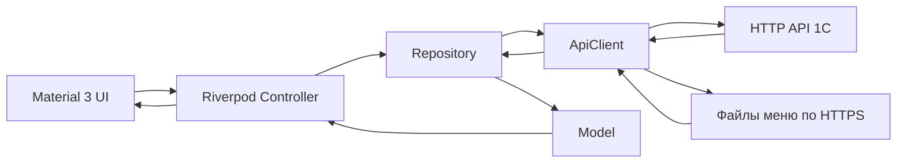

# Архитектура «Полевой кухни»

Версия 1.0 · 26.09.2026 · задача [FL-01-04](docs/tasks/FL-01-04.md).

## 1. Назначение и статус

Это целевая архитектура единого клиента Web/Android/iOS. Основания: [ТЗ](<Техническое задание.md>), решения пользователя и [справка NewProject](docs/newproject-reference.md). Указания пользователя и ТЗ имеют приоритет; согласованные исключения записываются здесь по П5. [AGENTS.md](AGENTS.md) содержит порядок работы, а [PROJECT_STATE.md](PROJECT_STATE.md) — фактическую точку продолжения.

После FL-01-13 реализованы запуск, конфигурация, первый экран site, тема/строки, единый router, адаптивный каркас, общий ApiClient и инфраструктура сессии через ручные Riverpod providers. SessionRepository использует общий транспорт, SessionController восстанавливает и очищает сессию, router получает её фактический статус. В FL-01-17 добавлен эталонный читающий модуль `features/menu` (Model → Repository → Controller → UI, ADR-6): читает публичный `dishes.json` через `apiClientProvider` без сессии, состояние — `AsyncValue` без скрытого автоматического повтора Riverpod. Модуль пока не подключён к `app/router.dart`; реальный маршрут `/menu` и его данные остаются бизнес-задачей этапа 4 (FL-04-04) с отдельным утверждённым контрактом. Формы входа, полная главная FR-S1, остальные бизнес-модули и живая приёмка ещё впереди. Названия остальных файлов ниже задают будущие границы; создавать пустые каталоги или объявлять функции готовыми на основании документа нельзя.

## 2. Единая схема и границы

Стек: Flutter/Dart, Material 3, Riverpod для состояния и внедрения зависимостей, go_router для адресуемой навигации. Сетевые данные поступают из существующего HTTP API 1С и опубликованных файлов меню/изображений. 1С определяет права, допустимость операций и окончательные суммы. Файлы меню — отдельный источник чтения с контрактом, а не замена проверки заказа сервером.

Состав модуля: **Model → Repository → Controller → UI**. Во время работы запрос идёт от UI к Controller и Repository, ответ возвращается как типизированная модель и состояние экрана:



| Часть | Ответственность | Граница |
|---|---|---|
| Model | Неизменяемые типизированные бизнес-данные и явный разбор полей ответа | Не знает виджеты, сеть и состояние загрузки. Идентификатор сущности берётся из контракта; для суммы/даты не придумывается серверный ID |
| Repository | Операции конкретного модуля, параметры запросов, разбор ответа в модели | Пользуется общим транспортом; не содержит навигацию и BuildContext |
| Controller | Команды пользователя, загрузка и состояние операции через ручной Notifier/AsyncNotifier | Не собирает HTTP-запросы и не обращается к хранилищу напрямую; не получает BuildContext |
| UI | Отображение loading/data/empty/error, ввод, локальная валидация и вызов Controller | Не вызывает HTTP и не рассчитывает окончательные суммы заказа |
| ApiClient | HTTPS, сериализация, таймауты, транспортные и нормализованные API-ошибки | Не знает виджеты, маршруты и расчёт корзины. Формат токена/ошибок берётся из контракта, не предполагается Bearer/JWT |

Используются конкретные Repository и ручные модели/providers. Дополнительный интерфейс, DTO, service или mapper допустим только с объяснением конкретной проблемы в карточке. Общая инфраструктура не импортирует `features/`; модуль не импортирует чужой экран или Controller. Сборка зависимостей и совместная компоновка модулей выполняются в `app/`. Общий компонент переносится в `shared/` при подтверждённом повторном использовании.

Вызовы защищённого API и чтение публичных файлов имеют раздельные настройки. Токен нельзя автоматически добавлять к произвольному URL изображения или меню. В FL-01-13 общий ApiClient остаётся независимым от сессии; SessionApi добавляет реквизиты к запросам защищённых Repository и проверяет поколение сессии до/после ответа. Личные Repository и их состояние должны зависеть от sessionApiProvider; публичные данные используют apiClientProvider. HTTP-перенаправления отключены, чтобы тело с токеном не уходило на адрес из Location. Смена сессии и router не создают обратную зависимость транспорта от UI.

## 3. Целевая структура

```text
lib/
  main.dart                         # запуск и сборка зависимостей
  app/
    app.dart                        # MaterialApp и состав приложения
    router.dart                     # единственный go_router
    theme.dart                      # общая Material 3 тема
  core/
    api/                            # транспорт и типизированные ошибки
    auth/                           # состояние сессии и работа с токеном
    config/                         # публичная конфигурация окружения
    platform/distribution.dart      # установка и стартовый маршрут (ADR-8)
  shared/
    widgets/                        # только общие используемые виджеты
  features/
    site/  auth/  menu/  cart/  orders/  profile/
test/                               # критические расчёты и нужные сценарии
web/                                # HTML-загрузка, SEO, manifest, статика
android/  ios/                      # платформенные оболочки единого lib
```

Распределение ответственности:

| Модуль | Что ему принадлежит | Зависимость/проверяемый результат |
|---|---|---|
| `site` | Главная, информация о компании, доставка, контакты, `/install` | Общие страницы и ссылки; правила установки получает из distribution |
| `auth` | Вход, регистрация, подтверждение email, восстановление | Согласованные операции API; передаёт результат входа в `core/auth`, не хранит пароль для будущих входов |
| `menu` | Каталог блюд, категории, доступные даты и выбор количества | `dishes.json` и `Orders/menudates` имеют разные роли; контракт — FL-00-10 и FL-04-04 |
| `cart` | Позиции по дням, черновик, предварительный расчёт, отправка | `pricing.dart` — чистый Dart по согласованной спецификации; факт принятия и итог — из 1С |
| `orders` | История и выбор позиций для повторного заказа | Повтор формирует новый черновик с проверкой текущего меню/дат; не отправляет старый заказ автоматически |
| `profile` | Профиль, условия клиента, «О приложении», вход в сценарий удаления | Профиль обновляется по токену; операции учётной записи доступны через согласованную зависимость, без импорта чужого Controller |
| `core/auth` | Восстановление/очистка сессии, токен и состояние входа | Не реализует формы регистрации и не дублирует серверные права |

Передача блюда из menu в cart и заказа из orders в cart идёт через типизированные данные/команды, соединённые в `app/`; не через доступ к чужому состоянию экрана. Конкретные модели и сигнатуры определяются вместе с контрактом функции. Эталон читающего потока закреплён в FL-01-17 на минимальном `features/menu` (без сессии, без маршрута); второй пример — cart с отдельным расчётом и защищённым транспортом.

## 4. Сессия, хранение и ошибки

Пароль используется для текущей операции входа, не попадает в постоянное хранилище, логи, конфигурацию или повторную загрузку профиля. После операции освобождаются ссылки и очищаются поля ввода; гарантированное обнуление памяти управляемой среды не заявляется. Многошаговая регистрация с повторной передачей пароля остаётся C-01: механизм нужно согласовать в FL-02-12 до FL-03-08–10.

Сохранённый токен не означает проверенную сессию. Состояния сессии различают восстановление, подтверждённый вход, отсутствие входа и ошибку проверки связи. Подтверждённая недействительность токена очищает сессию и ведёт ко входу; таймаут сам по себе не считается истечением токена. При выходе и смене пользователя сбрасываются загруженные персональные данные и состояние запросов. Поздний ответ старого пользователя не должен возвращать его данные в новую сессию. Отзыв токена сервером — отдельная желательная FL-02-20.

| Данные | Политика | Основание |
|---|---|---|
| Токен | `flutter_secure_storage`, доступ через `core/auth`; ограничения Web проверить при выборе версии | NFR-SEC-3, FL-01-07/13; защита Web не приравнивается к мобильной |
| Черновик | `shared_preferences`: необходимые позиции, количества, даты и привязка владельца; перед восстановлением сверить владельца и актуальные данные | FR-C4, ADR-3, FL-05-05/06 |
| Выбранный день и настройки UI | Минимальное локальное хранение через `shared_preferences` | ADR-3 |
| Профиль, условия, меню и история | В памяти текущей сессии; постоянная локальная бизнес-база не создаётся | ADR-3, NFR-SEC-2 |
| Фотографии и статика | Кэш по FR-M4 и NFR-PWA-2; не использовать его как источник актуальных цен/заказов | FL-04-09, FL-06-11 |
| `deviceId` | Принято пользователем 27.09.2026: постоянный UUID без New3_; в FL-01-13 UUID v4 хранится вместе с токеном в secure storage под отдельным ключом и сохраняется при logout. Ключи изолированы по окружению/API. Миграция старого DEVICE_ID отдельно | FL-01-13, C-07/C-08, FL-02-17, FL-08-04 |

Ошибки разделяются на потерю связи/таймаут, отказ авторизации, бизнес-отказ и неожиданный формат/сбой. Соответствие HTTP-кода и тела этому виду закрепляется по API-9; пароль, токен, полные профили и тела чувствительных запросов не журналируются. UI показывает понятное сообщение, введённые данные сохраняются в допустимых границах, успех появляется только после подтверждения сервера.

В FL-01-13 пользователь подтвердил восстановление через User/login с token/deviceId. HTTP 401 очищает токен; неоднозначный HTTP 400, сеть и неверный ответ при проверке сессии переводят её в unavailable без удаления токена. SessionGatePage допускает явный повтор проверки. Серверная проверка привязки и полнота профиля остаются FL-02-11/17; согласование клиента не подтверждает их готовность.

Для чтения возможен явный повтор пользователем. Для записи ApiClient не выполняет автоматический повтор. Повторное нажатие блокируется, пока отправка идёт. При потере ответа после отправки результат считается неизвестным: сначала предусмотренная контрактом проверка истории/статуса, затем безопасное повторение. Наличие кнопки «Повторить» по FR-C5 не разрешает повторную запись без защиты от дубля; протокол закрывается в FL-02-16 и FL-05-12.

## 5. Маршруты, интерфейс и платформы

Один router в `app/router.dart` содержит адреса из раздела 4.1 ТЗ: `/`, `/about`, `/delivery`, `/how-to-order`, `/contacts`, `/install`, `/sign-in`, `/sign-up`, `/reset-password`, `/menu`, `/cart`, `/orders`, `/profile`. В FL-01-10 закреплён публичный просмотр `/menu` по существующему сценарию сайта и FL-00-10; доступные дни и операции заказа требуют отдельной серверной проверки. `/cart`, `/orders`, `/profile` требуют подтверждённой сессии. Гость направляется ко входу с сохранением локального адреса; восстановление и ошибка проверки закрывают личное содержимое, сохраняя URI. Client redirect не заменяет серверные права. Реальная сессия подключается в FL-01-13; сейчас все пользователи — гости, незаполненные страницы обозначены как недоступные.

При обычном старте Web открывает `/`, нативные Android/iOS-приложения — `/menu` (ADR-8). Это значение по умолчанию: явный Web-адрес сохраняется и проходит общие проверки доступа; неизвестный адрес получает определённый экран/переход. Циклы redirect и перезапись запрошенного маршрута проверяются в FL-01-10.

Восстановление пароля завершается на Web-адресе `/reset-password` по FR-A3; ссылка на этот сценарий доступна из общего интерфейса. Формат ссылки, одноразовый контекст и серверная реализация ещё не утверждены (FL-02-13). Исключение не разрешает отдельную систему native callbacks или дополнительную бизнес-логику по платформам.

Material 3 и русские тексты общие; централизованное хранение строк и тема заложены в FL-01-09. Палитра и размеры типографики сверены с CSS действующего сайта; `Arial` с системным sans-serif используется как стек без встроенного файла шрифта, фактический вид на трёх платформах ещё не проверен. В FL-01-11 `LayoutBuilder` выбирает раскладку: `<600` — нижняя навигация и одна колонка, `600–1023` — NavigationRail, `>=1024` — совместный показ меню и корзины на их адресах; история и профиль остаются одной колонкой. Гость видит закрытую корзину без личных данных. Тестами проверены Enter на rail, Back и resize; полная приёмка прокрутки, клавиатуры, данных и платформ — впереди. Отдельные Cupertino/Fluent-экраны не создаются.

Web, Android и iOS остаются обязательными платформами. Настольные устройства используют браузер. Для iOS выбраны облачная сборка Codemagic и браузерный симулятор App Preview; фактическая настройка и iOS-проверки остаются в FL-01-16 и приёмке выпуска. Минимальные версии и состояние инструментов — [FL-01-02](docs/tasks/FL-01-02.md).

## 6. ADR и исключения

ADR-1–ADR-7 сохраняют ID раздела 8 ТЗ. Они фиксируют требования проекта; новые технические детали не подменяют контракт сервера. Изменение действующего решения записывается с причиной, последствиями, поведением трёх платформ и задачами проверки.

| ID | Решение и основание | Последствия и проверка |
|---|---|---|
| ADR-1 | Существующий HTTP API 1С, транспорт через `http` и ApiClient; данные меню читаются из опубликованных файлов. Основание: ТЗ 4.1/8 | Repository знает операции; права и окончательные суммы определяет 1С. Контракты — API-указатель; FL-01-12, FL-02-11/15/17 |
| ADR-2 | Регистрация и доступ определяются моделью 1С. Основание: ТЗ ADR-2, FR-A1–A6 | Не придумывать клиентские роли/статусы; удаление аккаунта не означает физическое удаление истории заказов. Семантика удаления согласуется с владельцем API в FL-02-14 |
| ADR-3 | Разрешены черновик корзины, выбранный день и настройки; токен — отдельное требование NFR-SEC-3. Основание: FR-C4 и раздел 8 | Черновик не даёт офлайн-права оформить заказ. Проверка владельца, устаревшего меню и очистки — FL-05-05/06; deviceId остаётся открытым решением |
| ADR-4 | Один `lib/`, три обязательные платформы Web/Android/iOS. Основание: Ц3, П1, ТЗ 4.3 | Платформенные каталоги содержат оболочки; общие функции проверяются на трёх платформах. Отсрочка iOS не меняет требования приёмки |
| ADR-5 | Кандидаты зависимостей — приложение А ТЗ; версии проверяются в FL-01-07 и фиксируются в `pubspec.lock` | Наличие в списке не доказывает совместимость выбранной версии. Подключать по назначению, учитывать Web-ограничения; ручные модели и providers без генераторов |
| ADR-6 | Первый эталон чтения — menu, затем cart. Основание: раздел 8 | Один подход Model → Repository → Controller → UI; расчёт cart изолирован в чистом Dart. Эталон `features/menu` реализован и проверен в FL-01-17 (27 тестов, без сессии и без маршрута); бизнес-версия и подключение к router — FL-04-04. Расчёт cart — FL-04-14, BL-1–BL-5 |
| ADR-7 | Информационные страницы принадлежат модулю site; платформенные проверки собраны в `core/platform/distribution.dart`. Основание: П3, NFR-PWA-3 | Исходное разрешение — только установка/распространение. Расширение для стартового маршрута ограничено ADR-8; иных исключений не утверждено |

### ADR-8 — Разный старт для Web и нативного приложения

**Статус:** принято пользователем 26.09.2026 в FL-01-04; закрывает C-02 из [реестра решений](docs/tasks/FL-00-15.md).

**Причина:** раздел 4.1 ТЗ требует главную сайта в браузере и меню в установленном приложении; исходный П3 ограничивал проверку платформы только установкой. Пользователь разрешил также выбор стартового маршрута в distribution.dart.

**Решение:** единственный модуль определения платформы возвращает обычный старт `/` для Web и `/menu` для нативных Android/iOS. Router получает результат через зависимость. Платформенные проверки в router, бизнес-модулях и экранах не добавляются. Различие не меняет API, правила доступа, состав экранов, данные и расчёты. Установленная Web/PWA-версия остаётся Web для этого правила.

**Проверка:** в FL-01-10 проверить обычный старт каждой платформы, явный Web-адрес, общую обработку сессии и отсутствие циклов redirect; статически проверить расположение платформенных условий. Runtime-проверка iOS остаётся отложенной вместе со средой сборки.

## 7. Окружения, поставка и ограничения

API URL, источник меню/изображений и название окружения задаются публичной конфигурацией сборки (FL-01-06). Конфигурация клиента не является хранилищем секретов. Test/prod должны быть различимы, но отдельной тестовой базы по решению пользователя нет: интеграционные проверки используют существующий API и выделенных тестовых пользователей рабочей базы; поддомен не изолирует базу. Пригодность аккаунтов/заказов проверяется до живых сценариев. Browser CORS остаётся открытым.

HTML первой загрузки, SEO, manifest и кэш статики находятся в `web/` того же репозитория; отдельный сайт не создаётся. Контракты минимальной версии, обновления Web/PWA и миграции старых ключей закрепляются до выпуска. Прежний пароль не импортируется. `com.example.polevaya_kuhnya` остаётся временным ID до FL-07-03.

В проект не входят Supabase/PostgreSQL/RLS и модель pending/admin из примера, отдельный серверный framework, локальная бизнес-БД, синхронизация/очередь офлайн-записей, самостоятельные desktop-приложения, push, биометрия, геолокация, камера, платёжные SDK, native deep links и параллельные платформенные экраны. В `features/` запрещены `dart:html`, `dart:io` и платформенные каналы. Не вводятся универсальный CRUD framework и генераторы моделей/providers. Создание платформенного каркаса штатным Flutter CLI не относится к запрету генераторов прикладного кода.

## 8. Открытые решения до реализации

Канонические схемы, методы и ошибки не копируются сюда: [API-указатель 0.1](docs/api-1c.md) ведёт к аудиту и серверным документам. Решения C-01–C-08 хранятся в [FL-00-15](docs/tasks/FL-00-15.md); C-02 закрыт ADR-8, C-03 остаётся в границе установки.

| Условие | Что нельзя считать решённым | Задача до зависимой реализации |
|---|---|---|
| C-01 | Короткоживущая передача пароля в регистрации | FL-02-12, затем FL-03-08/09/10 |
| API-4/C-08 | Полнота профиля/истории по токену, проверка устройства, формат ошибок | FL-02-11/17, FL-01-12/13 |
| C-04 | Достаточность окончательных сумм в существующем ответе | FL-02-15 перед FL-05-11 |
| Безопасный повтор | Идемпотентность и способ выяснить итог потерянного ответа | FL-02-16 перед FL-05-12 |
| C-05 | Пригодность тестовых аккаунтов и данных; browser CORS | FL-02-18, FL-00-14d/FL-02-17 |
| C-06 | Постоянные ID, совместимость подписей и владельцы ключей | FL-07-03/04/05 |
| C-07/C-08 | Хранение/миграция deviceId, перенос и владелец черновика | FL-02-17, FL-08-04 до соответствующей реализации/перехода |
| API-2/API-5 | Восстановление пароля и удаление аккаунта | FL-02-13/14 до клиентских сценариев |

## 9. Критерии дальнейших задач

В карточке функции до кода фиксируются бизнес-цель, данные, операции, контракт и его версия, UI-сценарий, валидация и проверяемый результат. При реализации проверяется прохождение через единый поток, отсутствие скрытого хранения и платформенных бизнес-веток. Для расчётов обязательны спецификация и тесты BL-1–BL-4; тесты и анализ входят в CI по INF-3. Проверки выполняются в разрешённых условиях, непроверенное явно сохраняется в карточке.

Последовательность основного сценария: вход → подтверждённая сессия → меню и доступные даты → черновик и предварительные суммы → подтверждение заказа и итог сервера → история. Отказ сети сохраняет допустимый ввод/черновик, а неизвестный итог отправки не превращается в ложный успех. Выход очищает сессию; повторный заказ проходит проверку актуальных данных. Этот сценарий подлежит приёмке на всех трёх платформах; документ и статический анализ не заменяют её.
