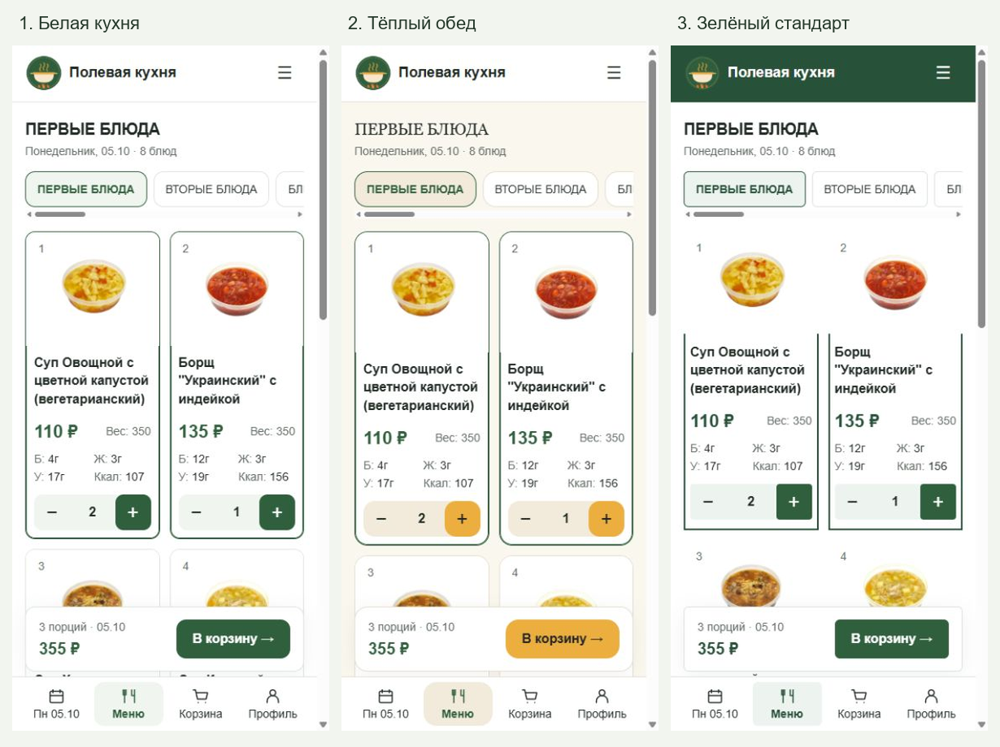
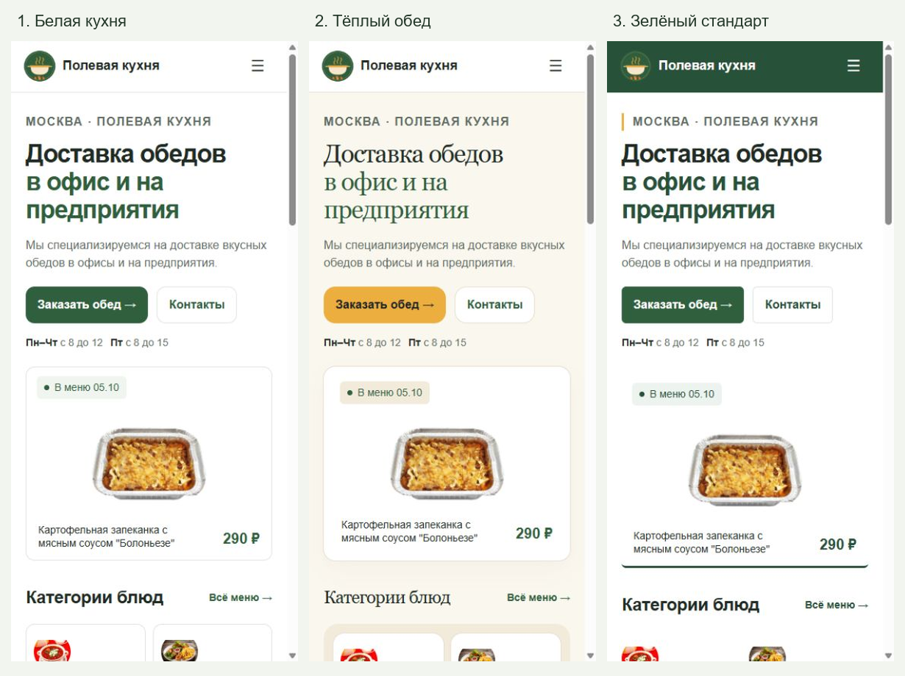

# FL-DESIGN-01 — Три дизайна с настоящим меню

01.10.2026. Самостоятельный анализ и три локальных HTML/CSS-прототипа по принятому плану. Flutter 0.1.0+54 не менялся.

## Открыть и сравнить

[Общий каталог](index.html) содержит работающие примеры и все 12 PNG. Во время этой сессии также доступен [локальный просмотр](http://127.0.0.1:8766/).

| Направление | Главная | Меню | Отличия |
|---|---|---|---|
| 1. Белая кухня — рекомендовано | [Пример](1-white-kitchen.html) | [Пример](1-white-kitchen.html?page=menu) | Белый фон, #305F3D, светло-зелёные поверхности, радиус 12 px |
| 2. Тёплый обед | [Пример](2-warm-lunch.html) | [Пример](2-warm-lunch.html?page=menu) | #FAF7EF вокруг белых карточек, #ECAF3F и тёмный текст кнопок, радиус 16 px, Georgia в крупных заголовках |
| 3. Зелёный стандарт | [Пример](3-green-standard.html) | [Пример](3-green-standard.html?page=menu) | Шапка #28513A, белые поверхности, тонкие линии, радиус 6 px, компактный каталог |





## Результат анализа

- Новый логотип: зелёная эмблема, кремовый котелок, золотистый пар и оранжевое пламя. Основной акцент действующего интерфейса #F15A24 и холодные серые поверхности относятся к предыдущему оформлению.
- Белая поверхность совместима с фотографиями сайта: её следует сохранить под изображениями во всех разделах. Зелёный связать с основными действиями, золотистый использовать как вторичный акцент.
- В действующей Web +54 на 1200 px боковые панели оставляют одну колонку каталога. В примерах 224 px слева и 400 px справа дают две карточки при 1200 и три при 1440.
- На телефоне уплотнить навигацию и развести основные/вторичные данные. В финальных примерах недели/дни скрыты сверху до 600 px: день выбирается нижней кнопкой, категории — горизонтальным списком; состав открывается фотографией. Это уточнение сохраняет доступность функций и освобождает место кнопкам количества.
- Текст 160% не уменьшается ради размещения. На телефоне каталог становится одноколоночным, нижняя навигация до 600 px располагается двумя рядами; широкие категории получают фото над текстом.
- Рекомендуется направление 1: фотографии и логотип хорошо сочетаются, основной интерфейс остаётся светлым и простым. Направление 2 теплее, но требует согласованного serif-шрифта при будущем переносе. Направление 3 сильнее подчёркивает рабочий характер сервиса.

Анализ: исходники, логотип, просмотр публичной Web +54 на широком/узком экране и исторические превью. Вход в текущей браузерной сессии завершился ошибкой проверки; закрытые профиль/история не объявляются живой приёмкой.

## Данные и фотографии

- [Исходный снимок](menu-snapshot.json), [манифест источников/хешей](sources.json), [браузерная копия снимка](menu-data.js).
- Источник: https://obedmoscow.ru/data/dishes.json; зафиксирован 01.10.2026, метка `2026-10-01T19:53:04.225216+03:00`. Все 10 дат двух недель сохранены. Начальный день у всех вариантов — 05.10.2026.
- SHA-256 меню: `0d5e440aa6001a22684fd8ea2a85f5d6811a9529f3d325d1f283c159b9c87efb`.
- 436 уникальных оригинальных JPEG сохранены в images/; суммарно 25 930 235 байт. Все прочитаны и проверены по SHA-256. Нет отсутствующих фотографий.
- Фотографии скопированы байт в байт, без обработки. `imagePath`, исходные `photo_version` и URL отражены в манифесте; локальные адреса включают версию фото. Важные фотографии показаны целиком с `object-fit: contain` на #FFFFFF. Миниатюры категорий также contain.
- Логотип — точная копия assets/branding/app-logo-cb1bbbb6c0df.png; SHA-256 `cb1bbbb6c0df984c206058572185d3f9b54aeec7c2a0aacdefb57f491ec320e9`.
- Настоящие названия, цены, вес, номера, пищевая ценность и состав сохранены. Для пустого веса — «Н/Д». На главной фотографии реальных блюд этого же дня, тексты/контакты — из действующего SiteContent и сайта.
- Цены без персональных скидок. На PNG меню выбран демонстрационный состав: 2 овощных супа по 110 ₽ и 1 борщ за 135 ₽, сумма 355 ₽. Это локальные количества прототипа, реального заказа нет. При открытии примера корзина пустая.

## Что работает

Главная/меню, выбор недель и всех дней снимка, категории, фотография/состав, плюс/минус, отдельные количества по дням и предварительный итог, resize без сброса данных, мобильная корзина/выбор дня/образец профиля. В правой панели — корзина, форма, календарь и сообщение; дополнительные сообщения доступны в образце входа. Модальные окна закрываются кнопкой/Escape и удерживают клавиатурный фокус.

API входа, отправка заказа, история пользователей и запись в постоянное хранилище не подключены. Количества исчезают после перезагрузки примера. Примеры не моделируют личную доступность заказа, скидки, ревизии и unknown outcome; их перенос не должен менять существующую бизнес-логику Flutter.

## Проверки

- [Протокол размеров](verification.json): 84 случая = 3 варианта × главная/меню × 7 ширин × 100%/160% текста. Ширины: 320/390/600/768/1024/1200/1440; viewport высотой 900.
- Горизонтального переполнения страницы, шрифтов меньше 14 px и зон управления ниже 44 px не найдено. У фото белая поверхность и contain; все видимые фотографии загрузились.
- На 320 px одна колонка, на 390 две; при 160% на телефоне одна. При 1200 px две, при 1440 три.
- В каждом варианте проверены 355 ₽, переход 390→1200, пустая корзина другого дня и возврат прежних количеств; форма на 390×480, ввод «Пример» и Escape. Уменьшенная высота окна проверяет размещение формы, но не является испытанием физической клавиатуры Android/iOS.
- 12 PNG действительно сняты в браузере при viewport 1440×1080 и 390×844 и визуально просмотрены. [Метаданные PNG](previews.json). API скриншотов слегка уменьшает исходный JPEG; экспорт восстанавливает указанные размеры пропорционально, без обрезания/перерисовки.
- Проверены синтаксис JS, сохранность 436 фотографий, снимка/логотипа и связи локальных ресурсов.
- Flutter analyze/test/build не запускались: код приложения и параметры сборки не изменены. Android не пересобран/не проверен на устройстве, iOS не запускалась. Общая пригодность дизайна для клиентов оценена; установленное приложение не принято.

## Воспроизведение

Открыть index.html в обычном браузере либо из корня Flutter запустить:

```powershell
python -m http.server 8766 --bind 127.0.0.1 --directory docs/design/FL-DESIGN-01
```

Затем открыть http://127.0.0.1:8766/. Сервер обслуживает только локальные примеры; публикация не выполнялась. После просмотра сервер можно остановить Ctrl+C.

`capture_data.py` воспроизводит снимок/копии фото. `--use-saved` использует уже сохранённый JSON и JPEG, восстанавливает отсутствующие файлы. Свежий снимок заменит данные примеров; это следует делать отдельно от сравнения текущих вариантов. На этой Windows JSON получен через Invoke-WebRequest, JPEG — curl.exe. Прямое чтение urllib первоначально давало таймауты; все файлы в конечном результате успешно получены.

`export_previews.py` преобразует снимки cua_repl из build/FL-DESIGN-01-captures/ в PNG, создаёт два листа сравнения и проверяет оригинальные ресурсы. Для Pillow использован bundled Python Codex; дополнительная установка не выполнялась. PNG/JPEG исходники скриншотов не являются фотографиями новых блюд.

## Точка остановки

Готовы локальные примеры, приложение не изменено и не опубликовано. Следующее действие — выбор пользователем варианта. Затем отдельный план переноса в общий Flutter UI с сохранением защищённых сценариев заказа.

Следующая: FL-DESIGN-02 — согласование выбранного направления и плана переноса; сложность 3/10, трудоёмкость низкая, LLM средняя; основание — общие токены и границы UX/бизнес-логики. Подзадача не начата, карточка не создана. Оценка реализации уточняется после выбора; доля прежних UX-пакетов не используется.

«Пересобрать Web и обновить тестовый flutter-test.obedmoscow.ru по SSH» — для этих примеров технически не требуется; понадобится после внедрения выбранного дизайна в приложение.
